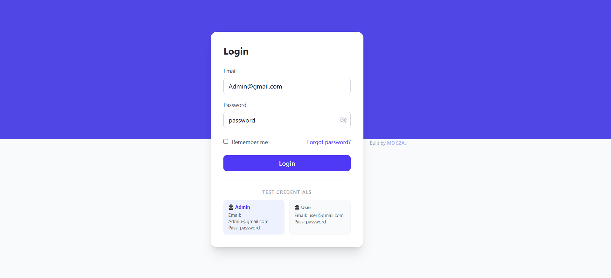
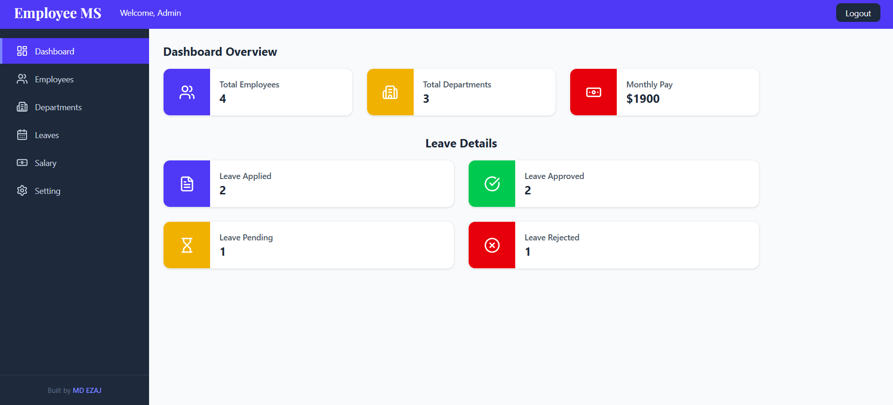
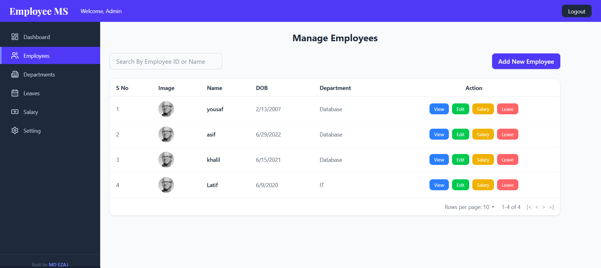
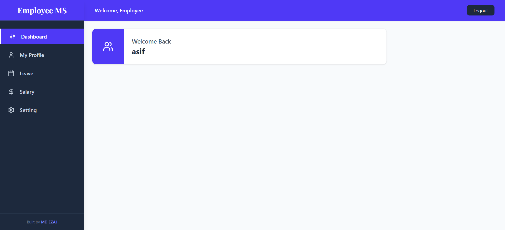

# Employee Management System (EMS) - Full Stack

A comprehensive, enterprise-level Full Stack application designed to streamline HR operations. This project features a robust **Spring Boot** backend and a modern, responsive **React** frontend, providing separate, secure dashboards for Administrators and Employees.

---

## 🚀 Live Demo

🔗 [View Live Project](https://ems-ezaj.netlify.app)

---

## 📸 Screenshots

### 🏠 Home / Login Page

### 👨‍💼 Admin Dashboard

### 👩‍💻 Employee Dashboard

---

## 🛠 Tech Stack

### Frontend

* **React.js** (Vite)
* **Tailwind CSS** (Styling & Layout)
* **React Router** (Navigation)
* **Axios** (API Communication)
* **Playfair Display & Inter** (Typography)

### Backend

* **Java 17**
* **Spring Boot 3**
* **Spring Data JPA** (ORM)
* **Spring Security** (Authentication & RBAC)
* **MySQL** (Database)
* **Maven** (Dependency Management)

---

## ✨ Key Features

### Admin Features

* **Dashboard Analytics:** Visual overview of total employees, departments, and monthly payroll.
* **Employee Management:** Full CRUD operations (Add, View, Edit, Delete).
* **Department Management:** Organize the workforce into specific units (IT, HR, Database, etc.).
* **Leave Management:** Review, approve, or reject employee leave requests with status filtering.
* **Salary Management:** Add and track salary history, allowances, and deductions for all staff.

### Employee Features

* **Personal Dashboard:** Personal welcome screen with a summary of their status.
* **Profile View:** View personal details, department info, and profile image.
* **Leave History:** Track the status of personal leave applications (Pending/Approved/Rejected).
* **Salary Slips:** View personal salary history and payment dates.

### Security

* **Role-Based Access Control (RBAC):** Restricts sensitive Admin routes from regular users.
* **Password Encryption:** Uses BCrypt for secure credential storage.
* **CORS Configuration:** Optimized for secure deployment on Netlify and Render.

---

## 📂 Project Structure

EMS/
├── frontend/               # React + Vite + Tailwind
│   ├── src/components/     # UI Components
│   ├── src/pages/          # Dashboard & Form Views
│   └── public/             # Static assets
└── backend/                # Spring Boot App
├── src/main/java/      # Java Source Code
├── src/main/resources/ # application.properties
└── pom.xml             # Maven dependencies

---

## ⚙️ Setup Instructions

### 1️⃣ Clone Repository

git clone https://github.com/your-username/EmployeeManagementSystem.git
cd EmployeeManagementSystem

---

### 2️⃣ Frontend Setup

cd frontend
npm install
npm run dev

---

### 3️⃣ Backend Setup

cd backend
./mvnw spring-boot:run

---

## 📌 Future Improvements

* Deploy backend (Render / Railway)
* Add JWT Authentication
* Improve UI/UX animations
* Add export (PDF salary slips)

---

## 👨‍💻 Author

**Md Ezaj**
Full Stack Developer (Java + React)
